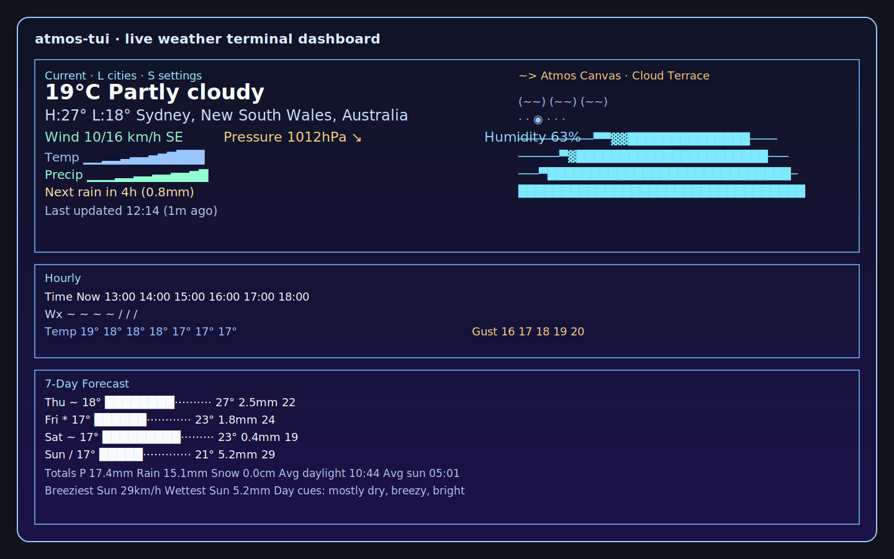

# atmos-tui

`atmos-tui` is a terminal-first weather dashboard focused on ambient visuals, clear hierarchy, and resilient live data updates.



## Highlights
- Three-panel responsive layout: `Current` / `Hourly` / `7-Day`
- High-value weather signals:
  - current: temp, feels-like, dew point, humidity, pressure trend, visibility, wind/gust, cloud layers, UV
  - hourly: time, icon, temp, precipitation, gusts, visibility, cloud/pressure rows (space-adaptive)
  - daily: min/max range bars, precip totals, gust maxima, week summaries and day cues
- Hero visual modes (right side of Current panel):
  - `Atmos Canvas`: data-driven terrain + condition overlays
  - `Gauge Cluster`: live instrument panel
  - `Sky Observatory`: sun/moon arc + condition/precip lanes
- Theme system with contrast-safe semantic colors and multiple presets
- Particle ambience (rain/snow/fog/thunder) with reduced-motion and flash controls
- Deterministic geocoding + ambiguity selector
- Resilience model with fresh/stale/offline states and retry backoff
- Persistent settings + location history across sessions

## Prerequisites
- Rust stable toolchain (`rustup`, `cargo`, `rustc`)
- UTF-8 capable terminal (TrueColor recommended)
- Network access (Open-Meteo APIs)

## Install
```bash
git clone <repo-url>
cd terminal-weather
rustup default stable
cargo build --release
```

## Run
```bash
cargo run -- Stockholm
cargo run -- --units fahrenheit Tokyo
cargo run -- --hero-visual gauge-cluster --theme midnight-cyan "San Diego"
cargo run -- --hero-visual sky-observatory --reduced-motion London
cargo run -- --ascii-icons --no-animation Reykjavik
cargo run -- --lat 59.3293 --lon 18.0686
```

## CLI
```bash
atmos-tui [CITY]

Arguments:
  [CITY]                              City name (default: Stockholm)

Options:
  --units <celsius|fahrenheit>        Default: celsius
  --fps <N>                           15..60 (default: 30)
  --no-animation                      Disable particle animation
  --reduced-motion                    Lower motion mode
  --no-flash                          Disable thunder flash
  --ascii-icons                       Force ASCII icons
  --emoji-icons                       Force emoji icons
  --theme <auto|aurora|midnight-cyan|mono|high-contrast|dracula|gruvbox-material-dark|kanagawa-wave|ayu-mirage|ayu-light|poimandres-storm|selenized-dark|no-clown-fiesta>
                                      Theme override (default: auto)
  --hero-visual <atmos-canvas|gauge-cluster|sky-observatory>
                                      Current-panel visual mode (default: atmos-canvas)
  --country-code <ISO2>               Geocode bias (e.g. SE, US)
  --lat <FLOAT>                       Direct latitude (requires --lon)
  --lon <FLOAT>                       Direct longitude (requires --lat)
  --refresh-interval <secs>           Default: 600
  --help
  --version
```

## Keybindings
- `q` / `Esc`: quit
- `r`: manual refresh
- `s`: open/close settings
- `l`: open/close city switcher
- `f`: switch to Fahrenheit
- `c`: switch to Celsius
- `←` / `→`: scroll hourly strip
- `1..5`: choose city during ambiguity selection

## Settings (Persisted)
Stored at `~/.config/atmos-tui/settings.json` (override directory via `ATMOS_TUI_CONFIG_DIR`).

Settings include:
- units
- theme
- motion level
- thunder flash
- icon mode
- hero visual mode
- refresh interval
- recent city history

## Color and Terminal Compatibility
Color capability fallback:
1. TrueColor (`COLORTERM=truecolor` / `24bit`)
2. xterm-256 quantized
3. 16-color semantic fallback (`NO_COLOR`)

Icon fallback:
- Unicode (default)
- ASCII (`--ascii-icons`)
- Emoji (`--emoji-icons`)

## Screenshot Workflow (for GitHub updates)
Use the one-off script:

```bash
./scripts/capture_fullscreen_screenshot.sh
```

Optional output path:

```bash
./scripts/capture_fullscreen_screenshot.sh assets/screenshots/generated-fullscreen.png
```

This script is macOS-focused (`screencapture`) and captures your full display after a short countdown.

## Troubleshooting
- API/network errors:
  - app keeps last known good data visible
  - status progresses to `stale` / `offline` with retries
  - press `r` for manual refresh
- Tiny terminal:
  - below `30x15`, app shows resize warning only
- Icon width/alignment issues:
  - use `--ascii-icons`
- Coordinate input errors:
  - `--lat` and `--lon` must be passed together

## Development
```bash
cargo fmt --all -- --check
cargo clippy --all-targets --all-features -- -D warnings
cargo check --all-targets --all-features
cargo test --all --all-features
cargo build --release
```

## Attribution
Weather + geocoding data: [Open-Meteo](https://open-meteo.com/)
